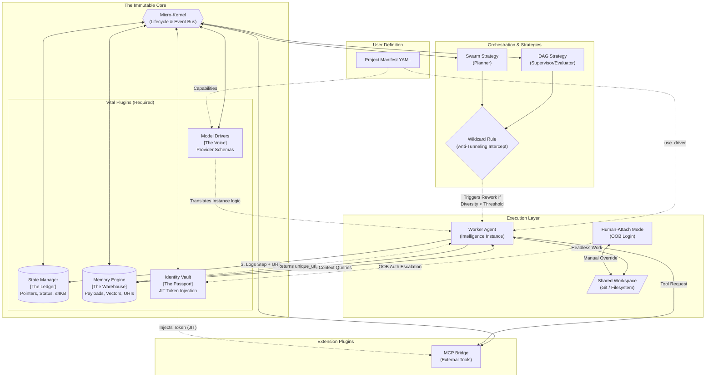

# Teldrassil: Modular Agentic Micro-Kernel Framework

Current agentic frameworks are often monolithic, coupling the orchestration logic with specific model providers and tool implementations. Teldrassil solves this "technical debt" by adopting a **Micro-Kernel Architecture** that decouples infrastructure (Plugins) from execution logic (Orchestrators) and task definitions (Project Manifests).

For a complete breakdown of the architecture, data boundaries, and protocols, please read the [Full Design Document](docs/design.md) and [Detailed Component Design](docs/detailed-components.md).

## Tech Stack

Teldrassil is built for hybrid deployment (Local CLI + Cloud Native). The core architecture leverages dynamic in-memory plugin loading to maximize performance.

- **Core & Orchestration:** TypeScript / Node.js
- **Managing UI:** React (Next.js) with Zustand/Jotai
- **Schema Validation:** Zod
- **Memory Security:** AES-256-GCM (Envelope Encryption) + HMAC Signed URIs

## System Architecture

The following diagram illustrates the flow of data, boundaries between Pointer (State) and Payload (Memory), and the "Immutable Core" of vital plugins.

